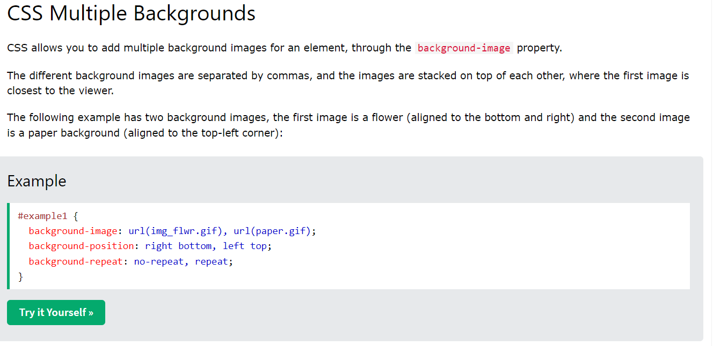

# Frontend Mentor - Profile card component solution

This is a solution to the [Profile card component challenge on Frontend Mentor](https://www.frontendmentor.io/challenges/profile-card-component-cfArpWshJ). Frontend Mentor challenges help you improve your coding skills by building realistic projects. 

## Table of contents

- [Overview](#overview)
  - [The challenge](#the-challenge)
  - [Screenshot](#screenshot)
  - [Links](#links)
- [My process](#my-process)
  - [Built with](#built-with)
  - [What I learned](#what-i-learned)
  - [Continued development](#continued-development)
  - [Useful resources](#useful-resources)
- [Author](#author)
- [Acknowledgments](#acknowledgments)

## Overview

### The challenge

- Build out the project to the designs provided

### Screenshot

### Links

- Solution URL: (https://www.frontendmentor.io/solutions/responsive-profile-card-L5o0Cyebv1)
- Live Site URL: (https://arkam-mohamad.github.io/profile-card/)

## My process

### Built with

- Semantic HTML5 markup
- CSS custom properties
- Flexbox
- Mobile-first workflow

### Useful resources

- [CSS Multiple Backgrounds](https://www.w3schools.com/css/css3_backgrounds.asp) - This helped me to style body element with images.

## Author

- Frontend Mentor - [@arkam-mohamad](https://www.frontendmentor.io/profile/arkam-mohamad)
